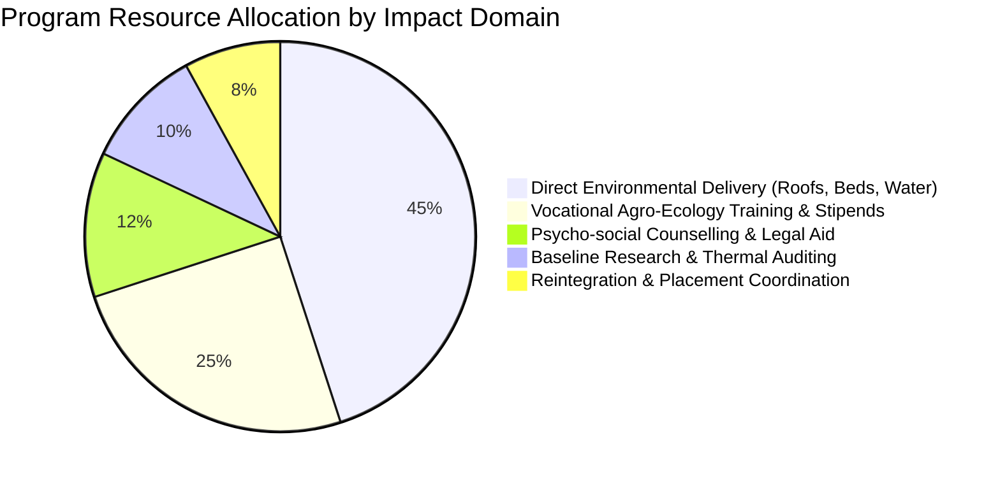
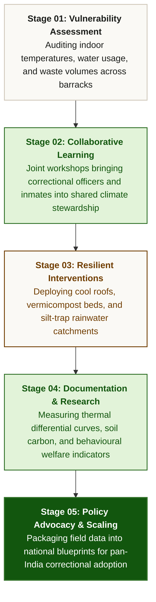

# 🌱 Eco-Reform — Towards Climate-Resilient Adaptive Prisons

[](https://react.dev/)
[](https://www.typescriptlang.org/)
[](https://vitejs.dev/)
[](https://tailwindcss.com/)
[](https://haryanaprison.gov.in/)
[](https://rainmatter.org/)
[](https://incometaxindia.gov.in)

> **Eco-Reform** is TYCIA Foundation’s flagship climate-resilience and restorative justice initiative. Pioneered at **Nuh District Jail, Haryana**, the programme transforms correctional facilities into climate-adaptive, ecologically regenerative, and rehabilitative institutions that prioritize prisoner wellbeing, dignity, and sustainable green skills.

---

## 📑 Table of Contents

- [Executive Overview](#-executive-overview)
- [Why Prison Reform Matters](#-why-prison-reform-matters)
  - [National Policy & Budgetary Context](#national-policy--budgetary-context)
  - [The Custodial Climate Vulnerability](#the-custodial-climate-vulnerability)
- [Visual Rehabilitation & Impact Pathways](#-visual-rehabilitation--impact-pathways)
  - [1. Prison Rehabilitation Pathway](#1-prison-rehabilitation-pathway)
  - [2. Holistic Program Focus Architecture](#2-holistic-program-focus-architecture)
  - [3. Before vs. After Rehabilitation Transformation](#3-before-vs-after-rehabilitation-transformation)
  - [4. 5-Stage Research-to-Action Protocol](#4-5-stage-research-to-action-protocol)
  - [5. 30 Climate Actions Taxonomy](#5-the-30-climate-actions-taxonomy)
- [Strategic Institutional Partners](#-strategic-institutional-partners)
- [Project Architecture & Key Features](#-project-architecture--key-features)
- [Local Development Setup](#-local-development-setup)
- [License & Institutional Attribution](#-license--institutional-attribution)

---

## 🏛 Executive Overview

Prisons represent hyper-dense, enclosed micro-communities that face severe environmental exposure. Heatwaves, ground heat absorption, groundwater depletion, and organic waste accumulation threaten both inmate health and correctional staff working conditions.

**Eco-Reform** proves that prisons do not have to be ecological dead zones. Through low-cost, decentralized physical interventions and participatory workshops, custodial facilities become learning hubs for permaculture, cool-roofing, water harvesting, and waste circularity.

```
┌────────────────────────────────────────────────────────────────────────┐
│                        PROJECT ECO-REFORM                              │
│                                                                        │
│   Institutional Access         Decentralized Interventions             │
│   Haryana Prisons Dept.  ───►  Cool Roofs • Rainwater • Permaculture   │
│                                           │                            │
│   Catalytic Ecosystem                     ▼                            │
│   Rainmatter Foundation  ───►  Rehabilitated Inmates & Certified       │
│                                Custodial Civic Eco-Stewards            │
└────────────────────────────────────────────────────────────────────────┘
```

---

## ⚖️ Why Prison Reform Matters

### National Policy & Budgetary Context

Prison modernisation is not merely an infrastructural question — it is an urgent human rights and public health priority recognized at the highest levels of governance:

- **₹300 Crore Modernisation Outlay (2024–25)**: The **Ministry of Home Affairs (MHA), Government of India**, has designated a ₹300 crore financial outlay under the *Modernisation of Prisons Scheme* targeting high-security infrastructure, correctional technology, and targeted initiatives for inmate reformation, living dignity, and social reintegration.
- **Model Prisons and Correctional Services Act, 2023**: Replaces archaic colonial laws with an explicit mandate for **after-care services, vocational skill development, psycho-social counselling, and structured community reintegration** to eliminate recidivism and restore civic identity.

> [!NOTE]
> *"Prisons are institutions for reformation and correctional treatment. The environment must foster personal growth, ecological mindfulness, and productive vocational capability."*  
> — Mandate aligned with the Model Prisons Act, 2023.

### The Custodial Climate Vulnerability

| Challenge Area | Ground Reality in Correctional Facilities | Eco-Reform Field Intervention |
| :--- | :--- | :--- |
| **Thermal Heat Spikes** | Concrete roofs absorb 45°C+ summer heat, radiating nocturnal thermal ceilings up to 48°C. | High-SRI white solar reflective coating & vetiver reed screens yielding **3.5°C to 5.2°C indoor cooling**. |
| **Water Scarcity** | Depleted aquifers and heavy dependency on external water supply tankers. | Multi-stage rooftop runoff silt-traps harvesting **450,000+ Litres** per monsoon for aquifer recharge. |
| **Organic Waste** | Over 250 kg of raw kitchen vegetable waste dumped unsegregated daily near perimeter walls. | Inoculated vermicomposting troughs converting **100% of organic mess scraps** into fertile compost. |
| **Food & Nutrition** | Barren cracked clay yards with zero vegetative canopy or fresh produce. | **1.2-acre permaculture kitchen garden** yielding 420+ kg of organic vegetables per harvest cycle. |
| **Enforced Idleness** | Idle custodial time breeding psychological anxiety, agitation, and recidivism. | Practical masterclasses certifying inmates as **Custodial Civic Eco-Stewards**. |

---

## 📊 Visual Rehabilitation & Impact Pathways

### 1. Prison Rehabilitation Pathway

A multi-phase transitional framework taking individuals from initial custodial admission through structured skill mastery to dignified societal reintegration:


---

### 2. Holistic Program Focus Architecture

Eco-Reform balances environmental infrastructure retrofits with comprehensive human capacity building:

```
┌─────────────────────────────────────────────────────────────────────────────┐
│                    ECO-REFORM PILLARS OF RESTORATION                        │
├─────────────────────────────────────────────────────────────────────────────┤
│  📚 Education              │ Practical climate literacy, ecology masterclasses     │
│  🛠 Vocational Training    │ High-SRI cool roof coating, composting & horticulture │
│  🧠 Counselling            │ Psycho-social resilience, trauma-informed mediation   │
│  🩺 Healthcare             │ Thermal shock reduction & fresh nutrient-dense diet   │
│  💼 Employment             │ Post-release certified green contractor placement    │
│  🤝 Family & Community     │ Community reconnect via verified restitution work     │
└─────────────────────────────────────────────────────────────────────────────┘
```



---

### 3. Before vs. After Rehabilitation Transformation

```
  BEFORE REHABILITATION                           AFTER REHABILITATION
┌───────────────────────────┐                   ┌───────────────────────────┐
│        ISOLATION          │                   │        REINTEGRATION      │
│ • Enforced thermal stress │                   │ • Certified green skills  │
│ • Monotonous barrack life │   Eco-Reform      │ • Organic food stewardship│
│ • Severed social ties     │  Intervention     │ • Improved mental health  │
│ • High recidivism risk    │ ───────────────►  │ • Post-release livelihood │
│                           │                   │                           │
│        OPPORTUNITY        │                   │         COMMUNITY         │
│ • Untapped human capacity │                   │ • Restored civic identity │
│ • 1.2 acres barren ground │                   │ • 420 kg organic harvests │
└───────────────────────────┘                   └───────────────────────────┘
```

| Dimension | Baseline State (Before) | Reformative State (After) |
| :--- | :--- | :--- |
| **Indoor Barrack Climate** | 45°C ceiling surface heat; relentless day-and-night thermal discomfort | Solar-reflective white roof coating reduces indoor temperature by **3.5°C – 5.2°C** |
| **Food & Nutrition** | 100% store-bought commercial diet lacking fresh organic greens | **420 kg fresh seasonal produce** harvested per cycle (gourds, moringa, spinach, tulsi) |
| **Waste Disposal** | Organic kitchen scraps rotting untreated, generating vector pests | **250 kg food waste diverted daily** via closed vermicomposting pits |
| **Custodial Identity** | Passive incarceration; idle routine and psychological distress | **165+ Certified Civic Eco-Stewards** leading daily farm operations |
| **Post-Release Pathway** | Social stigma, lack of capital, high vulnerability to re-offence | Structured placement in landscape permaculture, organic farming, and green construction |

---

### 4. 5-Stage Research-to-Action Protocol

The proven delivery framework that ensures all physical upgrades comply with strict prison security guidelines while maximizing ecological value:



---

### 5. The 30 Climate Actions Taxonomy

The interactive matrix categorizes 30 ground-tested standard operating procedures (SOPs):

| Category | Count | Focus Areas | Primary Target Metric |
| :--- | :---: | :--- | :--- |
| **1. Infrastructure & Thermal Comfort** | 6 | High-SRI cool roofs, reed blinds, natural cross-ventilation, microclimate shade | 3.5°C to 5.2°C cooler barracks |
| **2. Water Conservation & Harvesting** | 6 | Monsoon runoff silt traps, greywater reed-beds, groundwater aquifer sumps | 450,000 L rainwater saved |
| **3. Circular Waste Management** | 6 | Vermicomposting pits, segregative bins, bokashi fermentation, bio-mulching | 250 kg organic waste diverted/day |
| **4. Green Practices & Agronomy** | 6 | Raised bio-intensive soil beds, medicinal nurseries, native micro-canopy | 420 kg organic food/cycle |
| **5. Climate Literacy & Education** | 6 | Inmate masterclasses, joint staff workshops, peer steward certs | 165 certified Eco-Stewards |

---

## 🤝 Strategic Institutional Partners

Project Eco-Reform is built on mutual trust, institutional co-creation, and transparent philanthropic partnership:

### 1. Haryana Prisons Department
- **Role**: Government Host & Implementation Partner.
- **Contribution**: Direct institutional access across Nuh District Jail, compound facilitation, custodial staff assignment, and administrative co-ownership of rehabilitative programmes.
- **Motto**: *सुधार, पुनर्वास एवं समायोजन (Reformation, Rehabilitation & Reintegration)*.

### 2. Rainmatter Foundation
- **Role**: Catalytic Climate & Ecology Partner (an initiative by Zerodha).
- **Contribution**: Flexible funding, systems-level mentorship, and strategic network access to accelerate climate mitigation, decentralized circular solutions, and sustainable livelihoods.

---

## 💻 Project Architecture & Key Features

```
CO-REFORM-main/
├── public/
│   ├── haryana-prisons-logo.jpg      # Official Haryana Prisons emblem
│   ├── rainmatter-foundation-logo.png # Rainmatter Foundation lockup
│   ├── prisons-climate-map.webp      # High-resolution pilot facility schematic
│   └── tree-line-border.webp         # Mini decorative botanical divider
├── src/
│   ├── components/
│   │   ├── Navigation.tsx            # Symmetrical, centered glassmorphic header with scrollspy
│   │   ├── ActionsMatrix.tsx         # 30 Climate Actions taxonomy, search, filter & facility simulator
│   │   ├── PilotJailMap.tsx          # Interactive Nuh District Jail schematic with hotspot zoom
│   │   ├── BrochureModal.tsx         # High-resolution field brochure publication viewer
│   │   ├── BrochureScreens.tsx       # Dual-panel brochure facsimile with zoom & print controls
│   │   ├── DonationModal.tsx         # Section 80G tax-exempt digital giving portal
│   │   └── VolunteerModal.tsx        # Civic reform coalition volunteer enrollment
│   ├── data/
│   │   └── brochureData.ts           # Unified data schema for actions, tiers, challenges & stories
│   ├── App.tsx                       # Main single-page application orchestrating all sections
│   ├── index.css                     # Tailwind design tokens, typography, and glassmorphism utilities
│   └── main.tsx                      # Vite React entrypoint
├── index.html                        # Semantic HTML5 root with Manrope & Newsreader fonts
├── vite.config.ts                    # Build & asset bundle configuration
└── package.json                      # Dependencies and scripts
```

### Key Highlights
- **100% Client-Side React + Vite**: Instant hot-module replacement and ultra-fast production builds (`~220ms`).
- **Fully Responsive & Centered**: Tailored flex-1 compartments ensure the top navigation remains centered without button clipping across all screen sizes.
- **Accessible Modal Layering**: Dedicated top-right close controls, ESC key dismiss listeners, and backdrop click handlers across all modals.
- **Authentic Facsimile Viewer**: Full visual replication of the official field publication printed for Nuh District Jail.

---

## 🚀 Local Development Setup

### Prerequisites
- **Node.js** (v18.0.0 or higher)
- **npm** (v9.0.0 or higher)

### Installation & Run

1. **Clone the repository:**
   ```bash
   git clone https://github.com/kanishkam2406/Eco-Reform.git
   cd Eco-Reform
   ```

2. **Install project dependencies:**
   ```bash
   npm install
   ```

3. **Start the local development server:**
   ```bash
   npm run dev
   ```
   The application will be live at `http://localhost:3000`.

4. **Build for production:**
   ```bash
   npm run build
   ```
   Generates an optimized bundle in the `dist/` directory.

---

## 📄 License & Institutional Attribution

© 2015–2026 **TYCIA Foundation (Turn Your Concern Into Action)**.  
Project **Eco-Reform** is carried out in institutional collaboration with the **Department of Prisons, Haryana**, and supported by **Rainmatter Foundation**.

*Registered Trust ID: Reg. 476/2015 under Indian Trusts Act, 1882.*  
*Donations qualify for Section 80G and Section 12A tax exemption under Indian Income Tax Act.*
